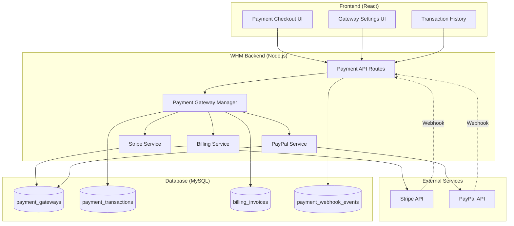
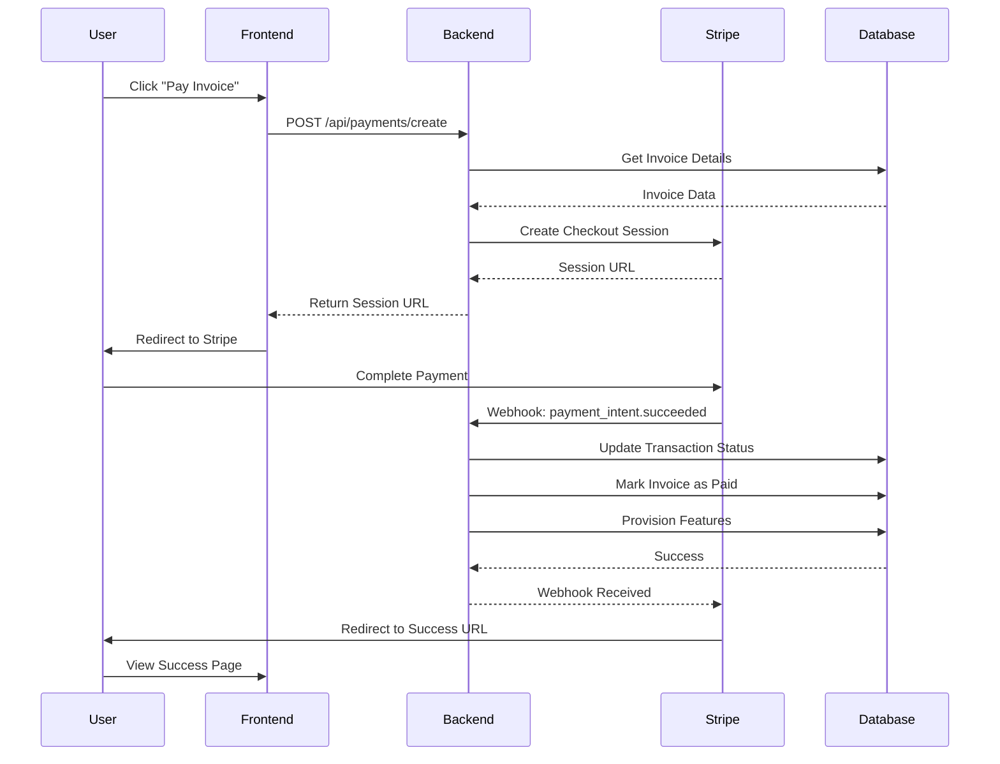
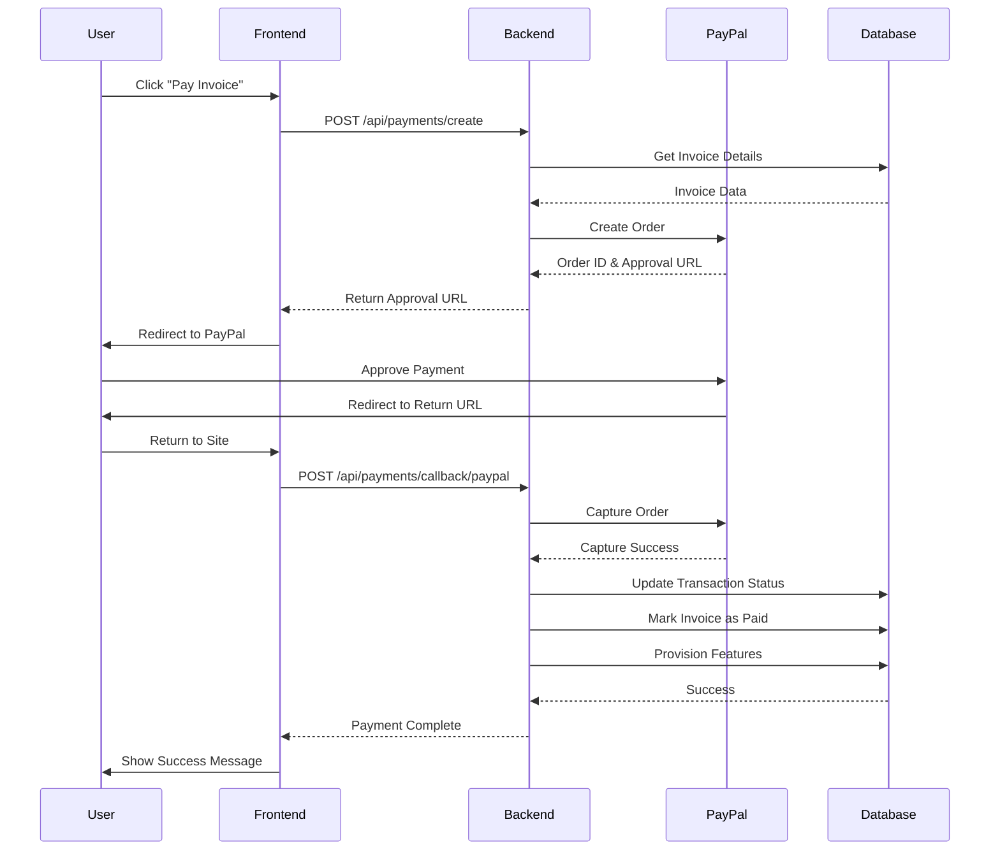
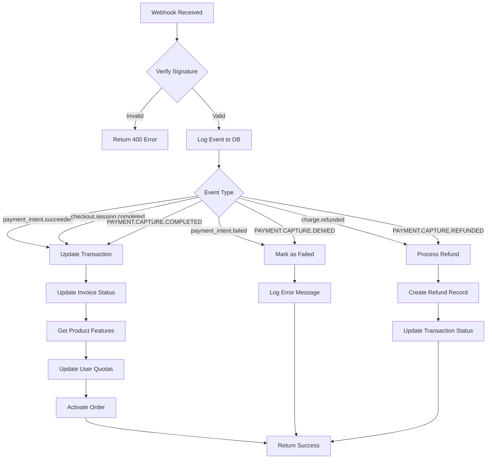
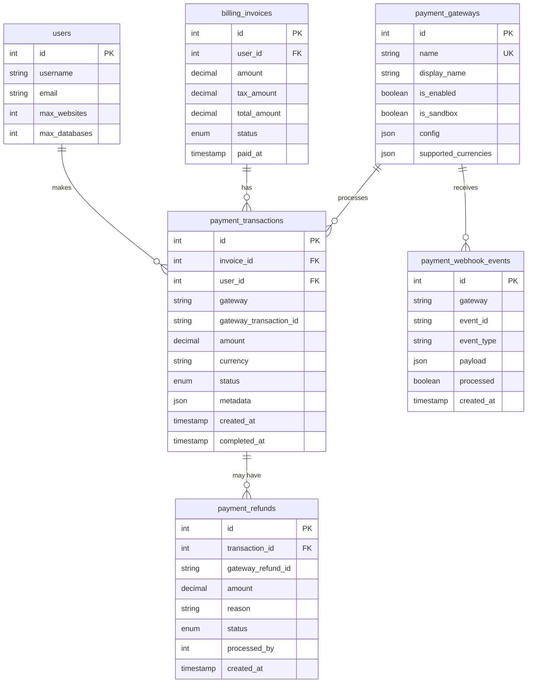
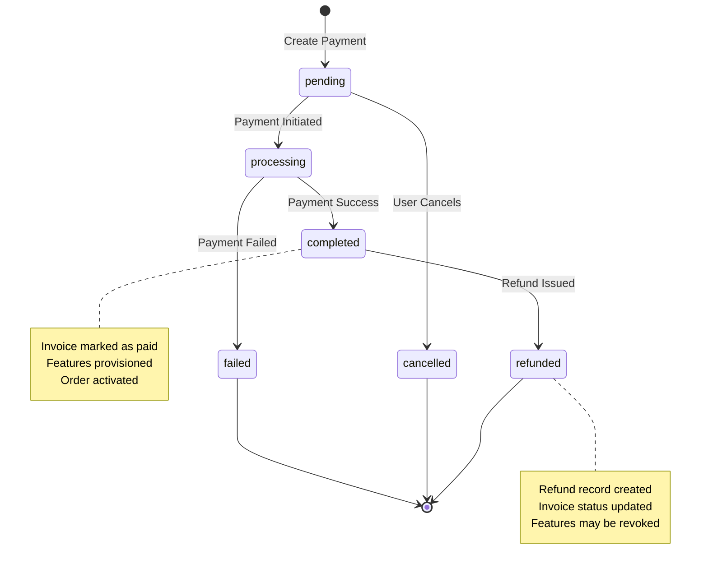
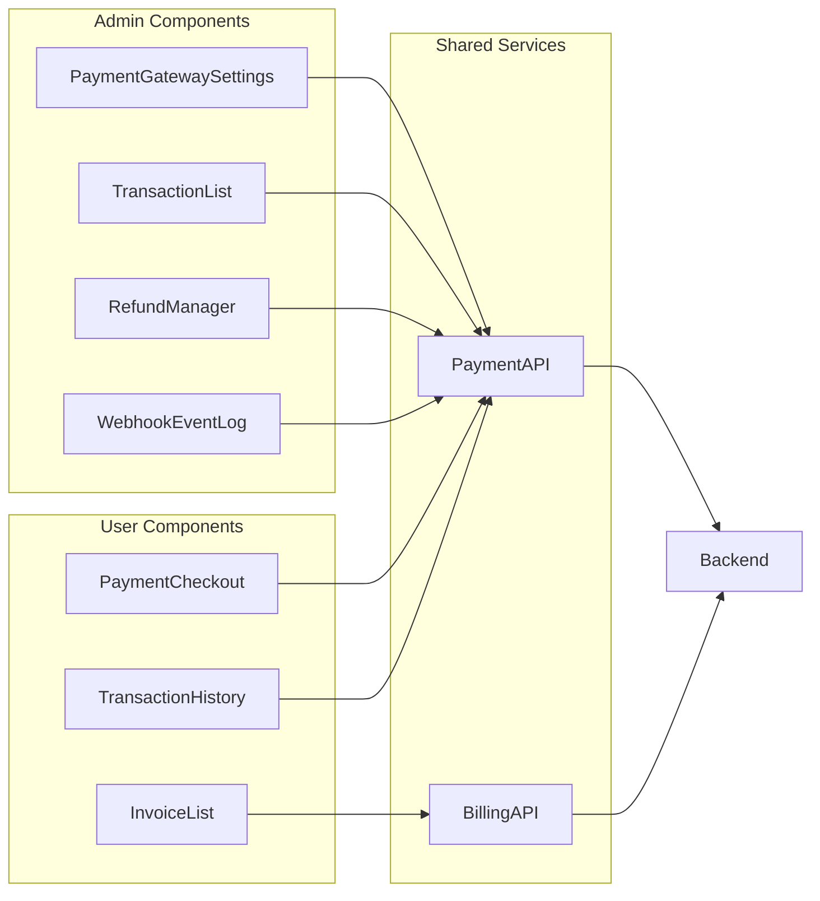
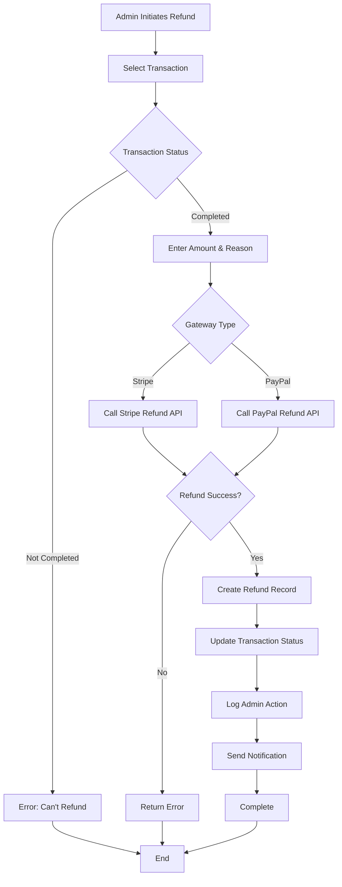

# Payment Gateway Architecture Diagrams

## System Architecture

## Stripe Payment Flow

## PayPal Payment Flow

## Webhook Processing Flow

## Database Schema Relationships

## Transaction State Machine

## Component Architecture

## Refund Processing Flow

---

## Legend

- **Solid Lines**: Direct API calls
- **Dashed Lines**: Webhook/Async events
- **Rectangles**: Components/Services
- **Cylinders**: Database tables
- **Diamonds**: Decision points
- **Rounded Rectangles**: Processes

---

**Generated**: January 11, 2026  
**Version**: 3.0.0-alpha
