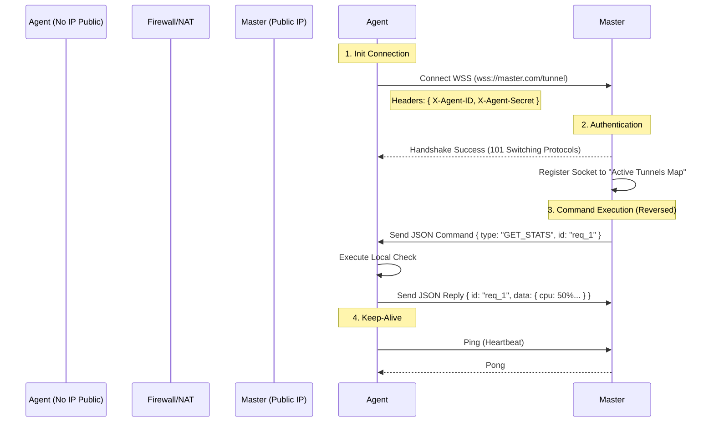

# Yumna Tunnel: Reverse Connection Architecture for NAT Routing
> **Status**: Implemented / Integrated
> **Version**: 1.0.0
> **Released in**: Yumna Panel v3.2

## 1. Overview
Fitur ini memungkinkan **Agent Nodes** yang berada di dalam jaringan privat (di belakang NAT/Firewall) atau tanpa IP Public untuk dikelola sepenuhnya oleh **Master Node** (WHM). 

Sistem saat ini (v3.1) menggunakan model **Push/Pull** di mana Master menghubungi Agent via HTTP/SSH. Model ini mewajibkan Agent memiliki IP yang bisa diakses (Public IP) atau berada dalam satu VPN.

**Yumna Tunnel** membalik paradigma ini: **Agent yang menghubungi Master** untuk membuka jalur komunikasi persisten.

## 2. Architecture: WebSocket Reverse Tunnel

Kami akan menggunakan **Secure WebSocket (WSS)** sebagai transport layer utama. WebSocket ideal karena:
1.  Bekerja di atas port HTTP/HTTPS standar (80/443), ramah firewall.
2.  Bersifat **Full-Duplex** (dua arah).
3.  Persistent connection (koneksi terus terjaga).

### 🏷️ Schema Diagram



## 3. Security Mechanism 🔒

Keamanan adalah prioritas utama karena kita membuka jalan masuk ke server privat.

### A. Transport Security
-   Semua komunikasi **WAJIB** menggunakan **WSS (WebSocket Secure)** yang dienkripsi via TLS 1.2/1.3.
-   Ini mencegah *Man-in-the-Middle* (MitM) attacks dan penyadapan packet.

### B. Authentication & Authorization
1.  **Handshake Auth**: Saat Agent mencoba connect, ia mengirimkan `X-Agent-ID` dan `X-Agent-Secret`.
2.  **Validation**: Master mengecek database `servers`. Jika ID dan Secret cocok, koneksi diterima.
3.  **Strict Whitelisting**: Hanya Agent yang terdaftar dengan status `active` atau `unknown` yang boleh connect. Agent `suspended` ditolak.

### C. Replay Attack Prevention
-   Setiap command memiliki `requestId` unik dan timestamp.
-   Commands yang kadaluarsa (> 30 detik) akan ditolak.

## 4. Technical Implementation Changes

### Phase 1: Master Node Update (WHM)
-   Integrasi `ws` library atau `socket.io` ke Express Server yang sudah ada.
-   Membuat `TunnelManagerService.js`:
    -   Menangani koneksi masuk WSS.
    -   Menyimpan map `Map<AgentId, WebSocket>`.
    -   Menyediakan method `sendCommand(agentId, command, payload)`.
-   Update `ServerNodeService.js` untuk mengecek:
    -   Jika server tipe `remote_tunnel`, gunakan `TunnelManager`.
    -   Jika server tipe `remote_standard`, gunakan HTTP/SSH biasa.

### Phase 2: Agent Node Update
-   Membuat `TunnelClientService.js`:
    -   Melakukan auto-connect dan auto-reconnect (exponential backoff) ke Master.
    -   Mendengarkan message JSON dari Master.
    -   Routing message ke controller yang sesuai (misal: "GET_STATS" -> `SystemStatsController`).
-   Konfigurasi baru di `.env`: `MASTER_TUNNEL_URL=wss://panel.domain.com/tunnel`.

## 5. Protocol Payload Design

**Request (Master -> Agent):**
```json
{
  "id": "uuid-v4",
  "type": "EXEC_COMMAND",
  "service": "system",
  "action": "getUsage",
  "timestamp": 1700000000
}
```

**Response (Agent -> Master):**
```json
{
  "requestId": "uuid-v4",
  "status": "success",
  "data": { "cpu": 15.5, "ram": 4096 },
  "error": null
}
```

## 6. Implementation Roadmap

### Milestone 1: Core Tunneling (Minggu 1)
- [x] Setup WebSocket Server di WHM.
- [x] Setup WebSocket Client di Agent.
- [x] Implementasi Auth Handshake.
- [x] Tes koneksi Keep-Alive (Ping/Pong).

### Milestone 2: Command Routing (Minggu 2)
- [x] Routing Heartbeat via Tunnel.
- [x] Routing Server Stats via Tunnel.
- [x] Tampilan indikator "Tunnel Active" di Dashboard Node Orchestration.

### Milestone 3: Advanced Features (Minggu 3) ✅ COMPLETE
- [x] Remote Shell / Terminal via Tunnel (WebSSH lewat Tunnel).
- [x] File Transfer via Tunnel (Chunked Binary Transfer).
- [x] Auto-Provisioning UI & Install Script Generator.

**📚 Detailed Documentation:** See [TUNNEL_FILE_TRANSFER_COMPLETE.md](./TUNNEL_FILE_TRANSFER_COMPLETE.md) for:
- Complete API reference
- Architecture diagrams
- Security considerations
- Performance benchmarks
- Troubleshooting guide

## 7. Configuration Example

**Pada Agent (.env):**
```ini
CONNECTION_MODE=tunnel
MASTER_URL=wss://master-panel.com
AGENT_ID=agent-home-server
AGENT_SECRET=rahasiadapur
```

**Pada Master (Database):**
Set kolom `connection_type` pada tabel `servers` menjadi `tunnel`.
